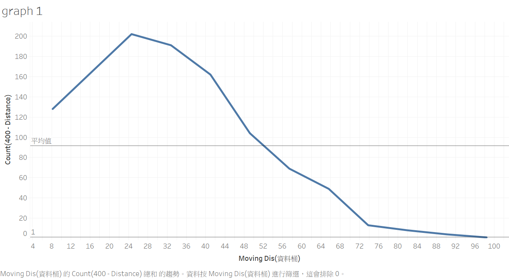

# first_repository
folder for my duel game project
Duel Game Project description

This project combine the use of Mathematics, Game Theory, Data Engineer and simple Data Science knowledge. The concept is inspired by the wordle and some letures on Game Theory. When I first learn about Duel Game and the best stregegy of it, I doubt it will not be accurate by using only calculation to find the highest probablity of winning.
Then, I recently saw a video on youtube where someone seek to find the best stregegy to play wordle. After that, I have a thought in my mind where I can use data to simulate the situation and find the solution using tables, which have is begining of this project.

Game Rules:

My own test:

From what I have learnt in Game Theory, the nash equiribrium will be 0.5, which means the best stregegy(pure stregegy) will be choose to shoot when the distance between two players is in half.

Since: 

(exp: If the original distance is 1m, then at the point when two players at half the distance Pr(hitting the shot = 0.5, by assumption)
at the case of pure stragegy, let shooting distance = x and player always shoot at x 
if x<0.5, then oppoent will try to hit faster than the player and get higher hitting prob
if x>0.5, then oppoent will just let player shoot and have low hitting prob

Since the course only cover the pure stregegy, in this project I will implement mix stregey at diff senerio 
where choosing several probaility function for testing. 

Case 1: x=y
this equations means that when distance decrease 1 unit, Pr(choose to shoot) += 1/total_distance 

the probabilty graph of two players will be looking like this. 

(which is same as the probaility of hitting the shot)

In my turtle_shooter.py, I simulate the case by letting two players have x=y probaility equation and look at what's happened. To save the data, I have connected to mysql server and put all my data in there. 
the table will be something like this:

[shoot,win,distance,same_or_diff]
["turtle 1 shoot","turtle 2 win",382,diff]
.
.
.
(for complete data, please see case1.csv)

If player choose to shoot and hit the shot, the same_or_diff column will be 'same'
else, will be 'diff'

More 'diff' than 'same' meaning people hit the shot at a very early stage(means x>0.5)
Back to my case, in this example, I have 1015 test case individualy and the result are in the following:

(We assume the distance is 400 units and player move 2 units by each round)

As we can see, there are 1038 diff and 114 same. The shooting range is around (0-100 units) where the mode is 24,
meaning player will choose to shoot very early in this probaility. B

There might be confusion that the range shouldn't be following upon the straight line(x=y)? Not really.. 
Use the example of player 1 in x=y prob function, the probility of shooting at [particular location] is
398/400 * 394/400 * 390/400 * 386/400 * .... n/400 , where the first non n probility are the Pr(not to shoot).

Since we know for two players to have x=y prob function will cause them to shoot too fast. We have to find the probaility function that have the shooting range between 200, so that when facing a player will pure stragegy(x = 0.5), other player can have a choice to choose whether he will shoot or not 

Case 2: y = x^n, where n >= 2 and n is positive integer.
After several test cases, I found the most possible case that can win the [0.5 pure stragegy], which is y = x^6
the result is in the following:

For that, we can see the 'same' amount increase to 314, having around 60% of total cases. The range is around 130 - 330 and the mode is 230. Is this the winning mix stregegy? Let's find out!

result = 
['turtle 1 win', 'turtle 2 win', 'turtle 2 win', 'turtle 1 win', 'turtle 2 win', 'turtle 2 win', 'turtle 2 win', 'turtle 1 win', 'turtle 2 win', 'turtle 1 win', 'turtle 1 win', 'turtle 2 win', 'turtle 2 win', 'turtle 1 win', 'turtle 1 win', 'turtle 2 win', 'turtle 2 win', 'turtle 1 win', 'turtle 2 win', 'turtle 1 win', 'turtle 1 win', 'turtle 1 win', 'turtle 2 win', 'turtle 2 win', 'turtle 2 win', 'turtle 2 win', 'turtle 2 win', 'turtle 1 win', 'turtle 2 win', 'turtle 2 win']

turtle 2 have 18 win > turtle 1 12 win 

it still cannot beat the pure stregegy.
For other cases, the result are the same, whatever you choose any kinds of mix stregegy like y = x^n, if the probability of hitting the shot is x=y, the best way is to just shoot at half of the distance. 

Software:

python(numpy,turtle,mysql.connector) > mysql(groupby) > tabelau(data visualization)
